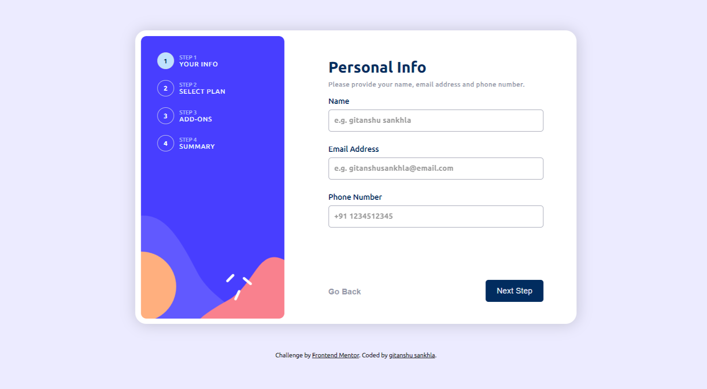

# Frontend Mentor - Multi-step form solution

This is a solution to the [Multi-step form challenge on Frontend Mentor](https://www.frontendmentor.io/challenges/multistep-form-YVAnSdqQBJ). Frontend Mentor challenges help you improve your coding skills by building realistic projects. 

## Table of contents

- [Overview](#overview)
  - [The challenge](#the-challenge)
  - [Screenshot](#screenshot)
  - [Links](#links)
- [My process](#my-process)
  - [Built with](#built-with)
  - [Continued development](#continued-development)
- [Author](#author)

## Overview
This project is an multi step form page, it is an single page website in which user can choose different options and according to their selection, the content of form dynamically get updates in real time.

### The challenge

Users should be able to:

- Complete each step of the sequence
- Go back to a previous step to update their selections
- See a summary of their selections on the final step and confirm their order
- View the optimal layout for the interface depending on their device's screen size
- See hover and focus states for all interactive elements on the page
- Receive form validation messages if:
  - A field has been missed
  - The email address is not formatted correctly
### Screenshot

### Links

- Solution URL: [Add solution URL here](https://your-solution-url.com)
- Live Site URL: [Add live site URL here](https://your-live-site-url.com)

## My process

### Built with

- Semantic HTML5 markup
- CSS custom properties
- Flexbox
- CSS Grid
- Mobile-first workflow
- Javascript localstorage

### Continued development

The project is still not perfect, there are many bugs in the working of the button. like if user has click of 'go back' button so now the user has to press 'next step' button two times to get to the next page.
This bug is happening because the state of current form is stored in localstorage and it only get update when user clicks button results in wrong updation of current form state.

## Author

- Instagram - [@lazydeveloper18](https://www.instagram.com/lazydeveloper18/)
- LinkedIn - [@gitanshu-sankhla](https://www.linkedin.com/in/gitanshu-sankhla/)
- Frontend Mentor - [@gitanshu18](https://www.frontendmentor.io/profile/gitanshu18)
